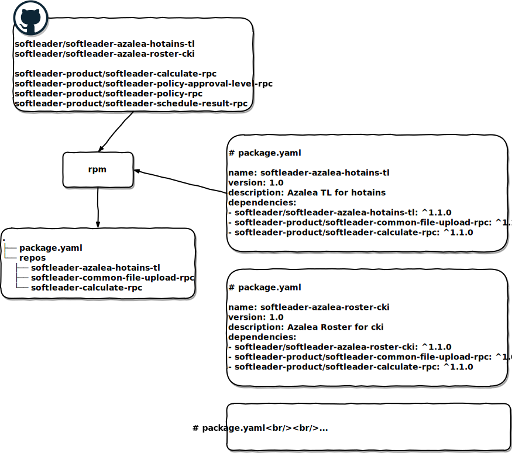

# repository-package-manager

rpm is the repository package manager for GitHub, inspired by npm

## Install

Clone and install via npm

```
$ git clone git@github.com:softleader/repository-package-manager.git
$ cd repository-package-manager
$ npm install -g
```

## Usage



```
$ rpm --help

  Usage: rpm [options] [command]


  Options:

    -V, --version  output the version number
    -h, --help     output usage information


  Commands:

    remote [options] [remote...]  Save GitHub remote & access token
    init                       Interactively create a package.yaml file
    install [repository...]    Install a repository <user or organization>/<repository>[@tag]
    uninstall <repository...>  Remove a repository <user or organization>/<repository>
    *

  https://github.com/softleader/repository-package-manager#readme
```
  
### remote

當你要操作 private repository 前, 你必須要加好 remote 及其 access token:

```
$ rpm remote
? name: softleader
? token: ooo
```

*Access token* 產生方式請參考 [Creating a personal access token for the command line](https://help.github.com/articles/creating-a-personal-access-token-for-the-command-line/), 請確認要給予 ***repo*** 的所有權限

產生好了以後會在 home 產生 *.rpm* 名稱的檔案, 你可以備份此檔已保留加過的 token

> 如果是 public repository 就不需要加入 remote

如果今天是在 pipeline 中或任何無法以互動式的指令加入 token 的情況下, 必須改成執行:

```
$ rpm remote --token ooo softleader softleader-project
```

### init

產生 `package.yaml`

```
$ rpm init
? name: my-project
? version: 1.0.0
? description: demo
...
```

`package.yaml` 中的格式為:

```yaml
name: my-project
version: 1.0.0
description: demo
dependencies:
  - {user or organization}/{repository}: {tag}
```

我們預設使用跟 npm 相同的 [node-semver](https://github.com/npm/node-semver) library 做 *{tag}*  的 parsing, 因此你可以:

- 指定切確 tag: `v1.0.7`
- 指定 range: `v1.0.x` := `>=v1.0.0 <v1.1.0`
- 自定義 range: `>=v1.0.0 <v1.1.7`

> 建議研讀 [node-semver#readme](https://github.com/npm/node-semver#readme) 了解更多的控制

### install

安裝指定 repository 及其版本

```
$ rpm install <user or organization>/<repository>[@tag]
```

會將指定 repository 的 clone 到 *repositories/* 下, 並 checkout 到指定 tag, 也會在 `package.yaml` 中加上該 dependencies 資訊, 目錄結構將呈現: 

```
.
├── package.yaml
└── repositories
    └── my-project
        ├── Containerfile
        ├── pom.xml
        └── ...
```

如果 install 後面沒有接任何 repository, 會將 `package.yaml` 中所有的 repository 都 clone 到 *repositories/* 下

```
$ rpm install
```

### uninstall

移除已安裝的 repository 及其 `package.yaml` 中的資訊

```
$ rpm uninstall <user or organization>/<repository>
```
