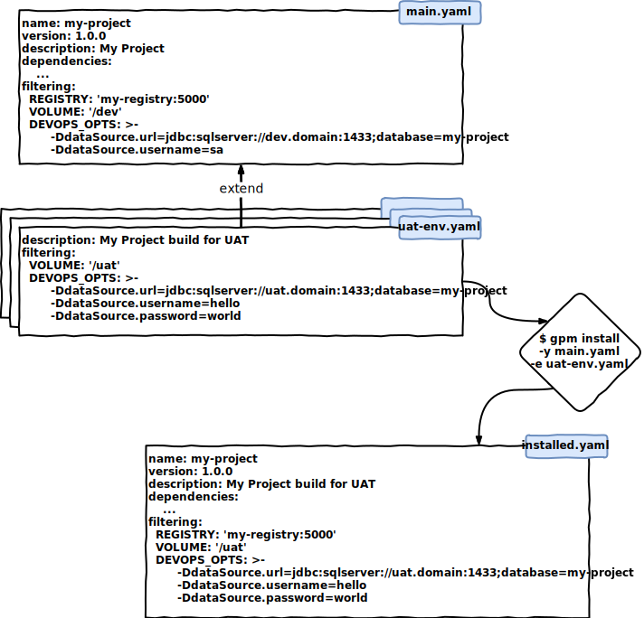

# git-package-manager

gpm is the package manager for git, inspired by npm & maven

## Install

```
$ npm install softleader/git-package-manager -g
$ gpm --version
17.12.1
```

or build from suorce code:

```
$ git clone git@github.com:softleader/git-package-manager.git
$ cd git-package-manager
$ npm install -g
// in Ubuntu. you should add Link in /usr/bin
/usr/bin$ sudo ln -s /usr/local/node-v8.11.1/bin/gpm gpm
$ gpm --version
17.12.1
```

or run on Docker:

```
$ docker run -itd -v path/to/gpm-dir:/app softleader/gpm
a2a47081658cfe506584d35ed88b7c60e3e8fae72a697943c6157524a1f2ee2f

$ docker exec a2a4 gpm --version
17.12.1
```
`path/to/gpm-dir` is the root dir where you want `gpm` to access

## Usage


```
$ gpm --help

  Usage: gpm [options] [command]


  Options:

    -V, --version  output the version number
    -h, --help     output usage information


  Commands:

    remote [options] [owners...]       Save GitHub remote owner & access token
    init                               Interactively create a package.yaml file
    install [options] [repository...]  Install a repository <owner>/<repository>[@tag]
    uninstall <repository...>          Remove a repository <owner>/<repository>
    *

  https://github.com/softleader/git-package-manager#readme
```
  
### remote

當你要操作 private repository 前, 你必須要加好 remote 及其 access token:

```
$ gpm remote
? owner: softleader
? token: ooo
```

> owner: softleader => 這樣就可以存取 softleader 底下的 repo

*Access token* 產生方式請參考 [Creating a personal access token for the command line](https://help.github.com/articles/creating-a-personal-access-token-for-the-command-line/), 請確認要給予 ***repo*** 的所有權限

產生好了以後會在 home 產生 *.gpm* 名稱的檔案, 你可以備份此檔已保留加過的 token

> 如果是 public repository 就不需要加入 remote

如果是在 pipeline 中或任何無法以互動式的指令加入 token 的情況下, 必須改成執行:

```
$ gpm remote --token ooo softleader softleader-product
```

### init

以互動式的指令產生 `package.yaml`

```
$ gpm init
? name: my-project
? version: 1.0.0
? description: demo
...
```

`package.yaml` 中的格式為:

```yaml
name: my-project
version: 1.0.0
description: demo
dependencies:
  - {owner}/{repository}: {tag}
  - {owner}/{repository}: {tag}
filtering:
  TAG: ${tag}
```

我們使用跟 npm 相同的 [node-semver](https://github.com/npm/node-semver) library 做 *{tag}*  的 parsing, 因此你可以:

- 指定切確 tag: `v1.0.7`
- 指定 range: `v1.0.x` := `>=v1.0.0 <v1.1.0`
- 自定義 range: `>=v1.0.0 <v1.1.7`

當指定 range 時, 我們會試著找到符合的 tags 中最後的一版作為 install 的目標

> 建議研讀 [node-semver#readme](https://github.com/npm/node-semver#readme) 了解更多的控制

### install

```
$ gpm install --help

  Usage: install [options] [repository...]

  Install repositories


  Options:

    -c, --contents <path>     specify the contents of a file to retrieve in each repository
    -F, --filtering           activete content filtering, only applies to contents of specifyied files
    -y, --yaml-file <path>    path to a YAML file, default 'package.yaml'
    -d, --install-dir <path>  path to directory to install, default 'repositories'
    -g, --group <group>       repository's install group, default no group
    -h, --help                output usage information

  Synopsis:

    gpm install (with no args, in package dir)
    gpm install <github owner>/<github repository>#[branch] (default master)
    gpm install <github owner>/<github repository>[@tag] (default latest tag)
```

安裝指定 repository 及其 tag 或是 branch

```
$ gpm install <github owner>/<github repository>#[branch] (default branch: master)
$ gpm install <github owner>/<github repository>[@tag] (default latest tag)
```

會將指定 repository 的 clone 到 *repositories/* 下, 並 checkout 到指定 tag 或是 branch, 也會在 `package.yaml` 中加上該 dependencies 資訊, 目錄結構將呈現: 

```
.
├── package.yaml
└── repositories
    └── my-project
        ├── Containerfile
        ├── pom.xml
        └── ...
```

如果 install 後面沒有接任何 repository, 會將 `package.yaml` 中所有的 repository 都 clone 到 *repositories/* 下

```
$ gpm install
```

####  -c, --contents \<path>

指定檔案內容, 以大幅的加速 install 時間 (預設模式是 clone 出完整的 repository 內容)

```
$ gpm install -c Containerfile -c path/to/some-file.adoc ...
```

執行後就只會有指定的檔案內容

```
.
├── package.yaml
└── repositories
    └── my-project
        ├── Containerfile
        └── path
            └── to
                └── some-file.adoc
```

#### -F, --filtering

在 `package.yaml` 中定義在 filtering 區塊的變數, 會在 [install 指定檔案內容](#-c---contents-path) 時 **(不會作用在完整 clone)**, 自動的取代檔案的內容

```yaml
# package.yaml

...
dependencies:
  - owner/my-project: v1.0.0
filtering:
  TAG: ${tag}
  name: Matt
```

在檔案的內容中, 使用 `${...}` 來宣告變數, 例如在 repository 的根目錄下有 `hello.txt`:

```
Hello ${name} @ @TAG@
```

接著執行:

```
$ gpm install -F -c hello.txt
```

則 `hello.txt` 將會被 clone 在:

```
.
├── package.yaml
└── repositories
    └── my-project
        └── hello.txt
```

且內容將轉變為:

```
Hello Matt @ v1.0.0
```

另外我們已經也預設提供了下述變數:

- `${owner}` - repository onwer
- `${repo}` - repository name
- `${tag}` - repository tag

#### -y, --yaml-file \<path>

指定要讀取的 YAML 檔案位置, 預設: `package.yaml`

##### GitHub supports

此指令也支援 GitHub 上的檔案:


```
# github:<onwer>/<repo>/<path-to-yaml>#[branch]
# github:<onwer>/<repo>/<path-to-yaml>@<tag>

$ gpm install -y github:softleader-product/softleader-package/package.yaml#hotains
```

則會先抓取 [softleader-product/softleader-package](https://github.com/softleader-product/softleader-package/tree/hotains) 中的 package.yaml 到當前目錄下再執行 install

#### -d, --install-dir \<path>

指定安裝的目錄, 預設: `repositories`

#### -g, --group \<group>

指定安裝的 group，例如執行 `gpm install -g security owner/my-project`，package.yaml 將會產生如下格式

```xml
dependencies:
  security:
    - owner/my-project: v1.0.0
filtering:
  TAG: ${tag}
  name: Matt
```

安裝的目錄也會依 group 區分

```
.
├── package.yaml
└── repositories
    └── security
        └── my-project
            └── ...
```

#### -e, --extend \<extend>

Extend 意指會將 `--yaml-file` 中的某些設定覆蓋掉，這邊是指定要覆蓋別人的 YAML 位置



### uninstall

移除已安裝的 repository 及其 `package.yaml` 中的資訊

```
$ gpm uninstall <github owner>/<github repository>
```

> 如果安裝時, 有下 `--yaml-file` 或 `--install-dir` 等參數, 在反安裝時也要記指定參數
