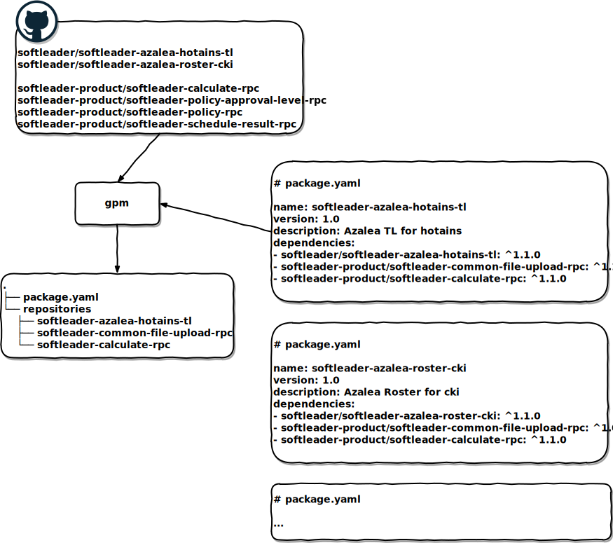

# repository-package-manager

rpm is the repository package manager for GitHub, inspired by npm

## Install

Clone and install via npm

```
$ git clone git@github.com:softleader/repository-package-manager.git
$ cd repository-package-manager
$ npm install -g
```

## Features

- `$ rpm remote --token <token> <user>` - to save user/organization & GitHub access token
- `$ rpm search [repo]` - to serch repository on regiested user/organization's github, shows branches & tags
- `$ rpm init` - initial `package.yaml` & `.gitignore`
- `$ rpm install --save [repo ...]` - to clone repo & save to `package.yaml`
- `$ rpm install` - to clone all repo by `package.yaml`
- `$ rpm uninstall --save <repo ...>` - remove the repositories & save to `package.yaml`

## Usage



